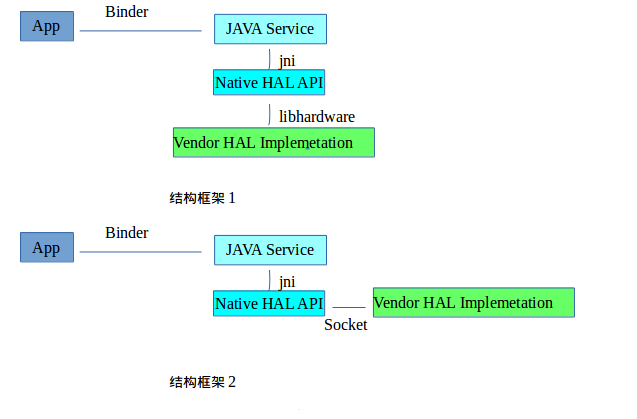
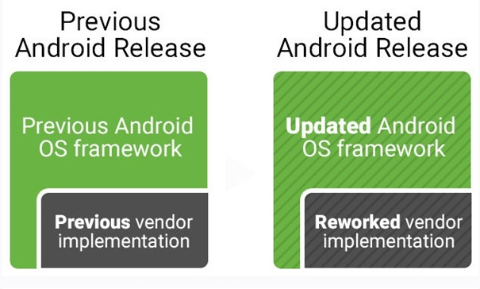
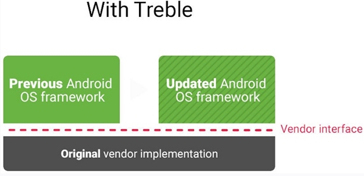
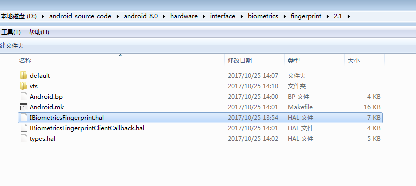
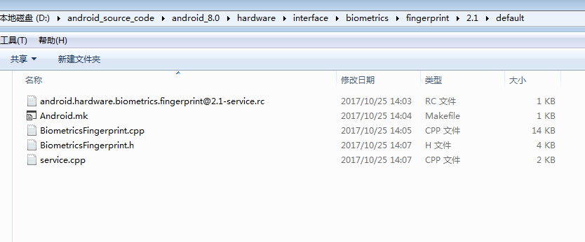

## Android O指纹识别解析
### 一、前言 - Project Treble
* 众所周知，Android 碎片化问题比较严重，新版本更新效率比较低，Google 为了解决此类问题，发布了 Project Treble 项目。Google 在Android O上，修改了框架.
* Android O与之前的Android 版本相比，多出了一个vendor.img分区.在此之前的Android 系统架构当中，Android Framework 与Android HAL是打包成一个system.img的，而且Framework 与HAL之间是紧耦合的，通过链接的方式使用相应的硬件相关so库。
* 老版本的android 的系统框架当中framework与HAL之间的一般架构框架是:

* 上面的框架结构中，Android framework跟Android HAL耦合度比较高，每次升级framework都需要升级对应的Hal,这个需要OEM厂商花费很大的精力。 

#### Android O及之后的版本的框架：
* 在Android O以及以后的版本当中，Android 更新了框架，引入了一套叫HIDL的语言来定义Freamework与HAL之间的接口，新的架构如下图

* 跟之前的版本相比，Android O使用HIDL 来解耦Android Framework 与Vendor HAL Implemetation之间的联系。Framework 跟HAL 会放在不同的分区下面，以往的版本HAL是跟Framework 放到system 分区，会被打包成system.img.而在Android O 上面，HAL是跟Framework 会放到不同的系统分区中，Hal会放到新的分区Vendor分区中，framework 还是在system分区中。这样就简化降低了Android 系统升级的影响与难度。

### 二、指纹启动流程分析
* 在看这个之前，可以先看我的另外一篇文章Android Fingerprint完全解析(二) ：Fingerprint启动流程，对android O版本之前的指纹流程有一定的了解
#
	1.frameworks\base\services\core\java\com\android\server\fingerprint\FingerprintService.java

    public synchronized IBiometricsFingerprint getFingerprintDaemon() {
        if (mDaemon == null) {
            Slog.v(TAG, "mDeamon was null, reconnect to fingerprint");
            try {
                mDaemon = IBiometricsFingerprint.getService();
            } catch (java.util.NoSuchElementException e) {
                // Service doesn't exist or cannot be opened. Logged below.
            } catch (RemoteException e) {
                Slog.e(TAG, "Failed to get biometric interface", e);
            }
            if (mDaemon == null) {
                Slog.w(TAG, "fingerprint HIDL not available");
                return null;
            }

            mDaemon.asBinder().linkToDeath(this, 0);

            try {
                mHalDeviceId = mDaemon.setNotify(mDaemonCallback);
            } catch (RemoteException e) {
                Slog.e(TAG, "Failed to open fingerprint HAL", e);
                mDaemon = null; // try again later!
            }

            if (DEBUG) Slog.v(TAG, "Fingerprint HAL id: " + mHalDeviceId);
            if (mHalDeviceId != 0) {
                loadAuthenticatorIds();
                updateActiveGroup(ActivityManager.getCurrentUser(), null);
                doFingerprintCleanup(ActivityManager.getCurrentUser());
            } else {
                Slog.w(TAG, "Failed to open Fingerprint HAL!");
                MetricsLogger.count(mContext, "fingerprintd_openhal_error", 1);
                mDaemon = null;
            }
        }
        return mDaemon;
    }
* mDaemon = IBiometricsFingerprint.getService();这句就是获取类似AIDL中的，得到远程服务对象中的本地代码对象。其实这个就是HIDL接口，后边会讲到。我们先看下这个IBiometricsFingerprint 接口是在哪里定义的，看下包名是在hardware 目录下，我们在此目录搜索
#
	import android.hardware.biometrics.fingerprint.V2_1.IBiometricsFingerprint;
	import android.hardware.biometrics.fingerprint.V2_1.IBiometricsFingerprintClientCallback;
* 会看到，代码结构如下图所示。

* IBiometricsFingerprint.hal 就是我们上面要找到的接口。当然，这只是一个接口，我们需要找到具体的实现地方。在本目录中看到一个default文件夹。

* 上面中看到，BiometricsFingerprint.cpp 文件就是IBiometricsFingerprint接口的实现类。
#### android.hardware.biometrics.fingerprint@2.1-service.rc
#
	service fps_hal /vendor/bin/hw/android.hardware.biometrics.fingerprint@2.1-service
	# "class hal" causes a race condition on some devices due to files created
	# in /data. As a workaround, postpone startup until later in boot once
	# /data is mounted.
	class late_start
	user system
	group system input
* 上面的rc文件，会启动fps_hal这个service。
#
	#include <android/log.h>
	#include <hidl/HidlSupport.h>
	#include <hidl/HidlTransportSupport.h>
	#include <android/hardware/biometrics/fingerprint/2.1/IBiometricsFingerprint.h>
	#include <android/hardware/biometrics/fingerprint/2.1/types.h>
	#include "BiometricsFingerprint.h"
	
	using android::hardware::biometrics::fingerprint::V2_1::IBiometricsFingerprint;
	using android::hardware::biometrics::fingerprint::V2_1::implementation::BiometricsFingerprint;
	using android::hardware::configureRpcThreadpool;
	using android::hardware::joinRpcThreadpool;
	using android::sp;
	
	int main() {
	android::sp<IBiometricsFingerprint> bio = BiometricsFingerprint::getInstance();
	
	configureRpcThreadpool(1, true /*callerWillJoin*/);
	
	if (bio != nullptr) {
	    bio->registerAsService();
	} else {
	    ALOGE("Can't create instance of BiometricsFingerprint, nullptr");
	}
	
	joinRpcThreadpool();
	
	return 0; // should never get here
	}