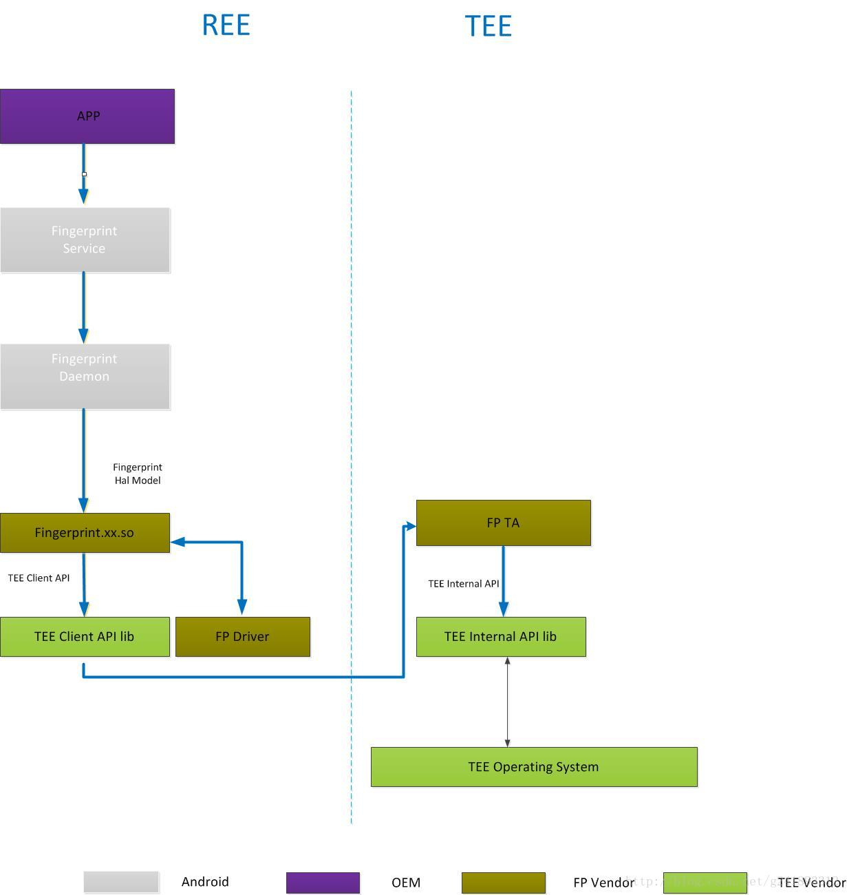

## Android Fingerprint完全解析(一) ：Fingerprint整体框架
### 1 TEE概述
* TEE: 可信执行环境（TEE，Trusted Execution Environment） 是Global Platform（GP）提出的概念，是和REE(Rich Execution Environment)相对应的，是ARM的一种模式。 我们一般也称TEE和REE为Secure World和Normal World。Android都跑在Normal World上，但是有些安全性要求比较高的行为，例如指纹的比对，支付时候用私钥签名的动作等，就要放到Secure World里面去了。TEE环境下也要有一个操作系统，海思有自己的Trustzone的操作系统，此外还有Trustonic、高通的QSEE、国内的豆荚等。
### 2 Android 6.0版本TEE 环境下Fingerprint 基本功能架构

* 如上图所示，指纹基本功能，主要由上图中的几个部分构成。 
其中：
具体职责划分如下：
#
 由OEM 厂商实现 

 由OEM厂商实现

 由指纹厂商负责

### 3 Android 6.0版本Fingerprint 启动流程
	1.init.rc 中启动fingerprintd 指纹（Fingerprint）的守护进程
	2.SystemServer 会启动指纹的系统服务 FingerprintSetvice
	3.FingerprintSetvice 调用fingerprintd 的接口，与ingerprint Hal 层通信
	4.fingerprint Hal 通过指纹厂商的驱动程序与指纹硬件交互

### 4 Fingerprint Hal 与TEE 环境的交互
* 为了安全着想，指纹硬件 SPI 等 挂载在TEE 环境下，指纹图像数据的采集，算法的相关处理都在TEE 环境下进行。REE 侧 只是得到TEE 侧的结果。后边会讲详细介绍高通QSEE ,Trustonic,豆荚。