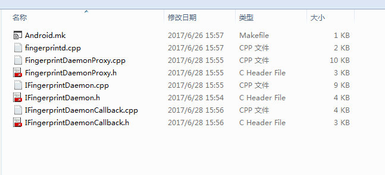
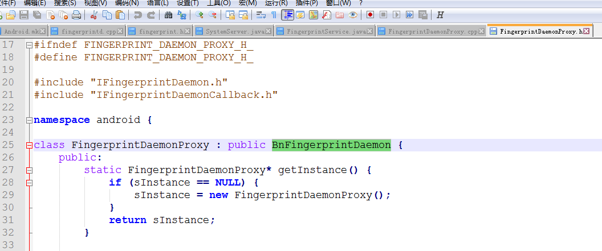
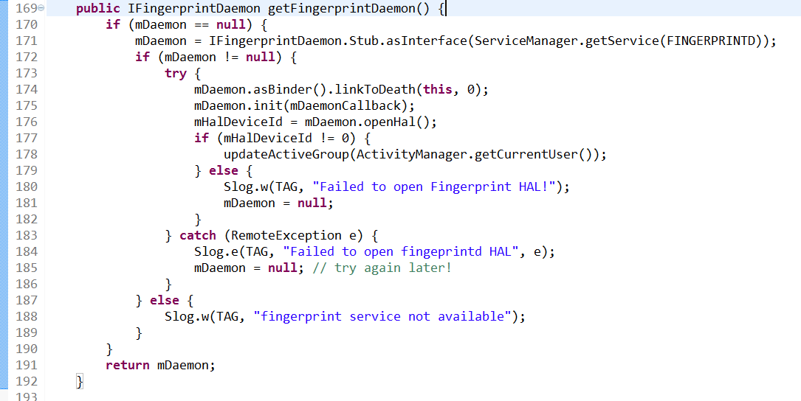

## Android Fingerprint完全解析(二) ：Fingerprint启动流程
### 前言
* 为了更好地阅读本文，你需要先阅读 Android Fingerprint完全解析(一) ：[Fingerprint整体框架](https://blog.csdn.net/g241893312/article/details/76893472) 这篇文章，在此文中，博主分析了Android 6.0 版本TEE 环境下 Fingerprint 的总体框架。阅读本文前，您需要对Android Binder 有一些了解。
### 步骤一.启动Fingerprintd
* 在init.rc 文件中启动fingerprintd；这个fingerprintd 是一个可执行文件。
#
	service fingerprintd /system/bin/fingerprintd
    class late_start
    user root
    group root sdcard_r sdcard_rw
* fingerprintd (system/core/fingerprintd 目录)

* fingerprintd 的Android.mk 文件
#
	LOCAL_PATH := $(call my-dir)
    include $(CLEAR_VARS)
    LOCAL_CFLAGS := -Wall -Wextra -Werror -Wunused
    LOCAL_SRC_FILES := \
    FingerprintDaemonProxy.cpp \
    IFingerprintDaemon.cpp \
    IFingerprintDaemonCallback.cpp \
    fingerprintd.cpp
    LOCAL_MODULE := fingerprintd
    LOCAL_SHARED_LIBRARIES := \
    libbinder \
    liblog \
    libhardware \
    libutils \
    libkeystore_binder
    include $(BUILD_EXECUTABLE)
* 从mk文件中 BUILD_EXECUTABLE 得知，此进程是一个可执行文件。
#
	system/core/fingerprintd/fingerprintd.cpp:
	int main() {
	android::sp<android::IServiceManager> serviceManager = android::defaultServiceManager();
	android::sp<android::FingerprintDaemonProxy> proxy =
	        android::FingerprintDaemonProxy::getInstance();
	android::status_t ret = serviceManager->addService(
	        android::FingerprintDaemonProxy::descriptor, proxy);
	if (ret != android::OK) {
	    ALOGE("Couldn't register " LOG_TAG " binder service!");
	    return -1;
	}
	
	android::IPCThreadState::self()->joinThreadPool();
	return 0;
	}
* 启动 native 层的指纹系统服务，调用addService()方法，向serivcemanager 注册server。 
这里用到Binder的IPC通信方式，这里可以自行去研究下;

* 从FingerprintDaemonProxy.h 这个文件可以看出，根据android Binder的知识，可以知道这个远程服务是FingerprintDaemon。 Fingerprintd 把这个远程服务，注册到serivcemanager，供客户调用，这个远程服务 
协议接口是 IFingerprintDaemon，framework 中的FingerprintSerVice 最终会调用这个远程服务，也就是会调用FingerprintDaemonProxy.cpp 里面的方法。

### 步骤二.启动FingerprintService
* SystemServer.java
#
	mSystemServiceManager.startService(FingerprintService.class);
* Android系统在加载SystemServer时候，去启动FingerprintService 指纹系统服务 (frameworks/base/services/core/java/com/android/server/fingerprint/FingerprintService.java)， 
调用FingerprintService 的onStart() 方法，如下：
#
	@Override
    public void onStart() {
        publishBinderService(Context.FINGERPRINT_SERVICE, new FingerprintServiceWrapper());
        IFingerprintDaemon daemon = getFingerprintDaemon();
        if (DEBUG) Slog.v(TAG, "Fingerprint HAL id: " + mHalDeviceId);
        listenForUserSwitches();
    }

### 步骤三.访问指纹远程服务(native层的)
* 从Fingerprintservice.java中的IFingerprintDaemon daemon = getFingerprintDaemon()，IFingerprintDaemon 从名字可以猜测这个是提供访问远程服务的协议接口。
#
	private static final String FINGERPRINTD = "android.hardware.fingerprint.IFingerprintDaemon";

* getFingerprintDaemon() 函数有如下动作：
#
	1.获取指纹远程Service对象，即FingerprintDaemon的对象（System/core/fingerprintd
	mDaemon = IFingerprintDaemon.Stub.asInterface(ServiceManager.getService(FINGERPRINTD));）
	2.初始化远程服务FingerprintDaemon,并且设置回调DaemonCallback
	mDaemon.init(mDaemonCallback);
	3.调用远程服务FingerprintDaemon 的openHal() 方法
	mHalDeviceId = mDaemon.openHal();

#### 总结：
* 由上可知，framework中的FingerprintService 调用native层的指纹远程服务FingerprintDaemon(跟硬件有关系)，可以把FingerprintService 看做指纹远程服务FingerprintDaemon的客户端。

### 步骤四.打开Fingerprint Hal层
	步骤三中
	public IFingerprintDaemon getFingerprintDaemon() {
        if (mDaemon == null) {
        	mDaemon = IFingerprintDaemon.Stub.asInterface(ServiceManager.getService(FINGERPRINTD));
        	if (mDaemon != null) {
            	try {
                	mDaemon.asBinder().linkToDeath(this, 0);
                	mDaemon.init(mDaemonCallback);
                	mHalDeviceId = mDaemon.openHal();
                if (mHalDeviceId != 0) {
                    updateActiveGroup(ActivityManager.getCurrentUser());
                } else {
                    Slog.w(TAG, "Failed to open Fingerprint HAL!");
                    mDaemon = null;
                	}
           	 	} catch (RemoteException e) {
                	Slog.e(TAG, "Failed to open fingeprintd HAL", e);
                	mDaemon = null; // try again later!
            	}
        	} else {
        	Slog.w(TAG, "fingerprint service not available");
        	}
    	}
    	return mDaemon;
	}

* getFingerprintDaemon() 方法会调用 mDaemon.init(mDaemonCallback)， mDaemon.openHal() ，两个方法，其实就是调用FingerprintDaemonProxy.cpp 的init()函数 跟openHal() 函数。
#
	void FingerprintDaemonProxy::init(const sp<IFingerprintDaemonCallback>& callback) {
	    if (mCallback != NULL && IInterface::asBinder(callback) != IInterface::asBinder(mCallback)) {
	        IInterface::asBinder(mCallback)->unlinkToDeath(this);
	    }
	    IInterface::asBinder(callback)->linkToDeath(this);
	    mCallback = callback;
	}

	int64_t FingerprintDaemonProxy::openHal() {
	    ALOG(LOG_VERBOSE, LOG_TAG, "nativeOpenHal()\n");
	    int err;
	    const hw_module_t *hw_module = NULL;
		// bird @ {add by lichengfeng for fingerprint sensor compatible 20170314 begin }
	    int i;
	    const char *fingerprint_id = "fingerprint";
	    int len = sizeof(fingerprint_list) / sizeof(fingerprint_dev_t);
	
	    for (i = 0;i < len; i++) {
	        if (!access(fingerprint_list[i].dev_name, F_OK)) {
	            fingerprint_id = fingerprint_list[i].dev_id;
	            property_set("sys.fingerprint.chip", fingerprint_list[i].chip_name);
				property_set("sys.iii.i","abc");
				ALOG(LOG_VERBOSE, "lizhenye", "Detect fingerprint id: %s ,chip_name:%s\n", fingerprint_id,fingerprint_list[i].chip_name);
	            ALOG(LOG_VERBOSE, LOG_TAG, "Detect fingerprint id: %s ,chip_name:%s\n", fingerprint_id,fingerprint_list[i].chip_name);
				//break;
	        } else {
				ALOGE("the file not exists, dev_name:%s\n", fingerprint_list[i].dev_name);
				continue;//
			}
	    //wangdong}
	
	    if (0 != (err = hw_get_module(fingerprint_id, &hw_module))) {
	        ALOGE("Can't open fingerprint HW Module:%s , error:%s %d", fingerprint_id, strerror(err), err);
	    if (0 != (err = hw_get_module(FINGERPRINT_HARDWARE_MODULE_ID, &hw_module))) {
	        ALOGE("Can't open fingerprint HW Module:%s , error:%s %d", FINGERPRINT_HARDWARE_MODULE_ID, strerror(err), err);
	        continue;//return 0;
	        }
	    }
	    if (NULL == hw_module) {
	        ALOGE("No valid fingerprint module");
	        continue;//return 0;
	    }
	
	    mModule = reinterpret_cast<const fingerprint_module_t*>(hw_module);
	
	    if (mModule->common.methods->open == NULL) {
	        ALOGE("No valid open method");
	        continue;//return 0;
	    }
	
	    hw_device_t *device = NULL;
	
	    if (0 != (err = mModule->common.methods->open(hw_module, NULL, &device))) {
	        ALOGE("Can't open fingerprint methods, error:%s %d", strerror(err), err); //Can't open fingerprint methods, error: -22
	        continue;//return 0;
	    }
	
	    if (kVersion != device->version) {
	        ALOGE("Wrong fp version. Expected %d, got %d", kVersion, device->version);
	        // return 0; // FIXME
	    }
	
	    mDevice = reinterpret_cast<fingerprint_device_t*>(device);
	    err = mDevice->set_notify(mDevice, hal_notify_callback);
	    if (err < 0) {
	        ALOGE("Failed in call to set_notify(), err=%d", err);
	        continue;//return 0;
	    }
	
	    // Sanity check - remove
	    if (mDevice->notify != hal_notify_callback) {
	        ALOGE("NOTIFY not set properly: %p != %p", mDevice->notify, hal_notify_callback);
	    }
	
	    ALOG(LOG_VERBOSE, LOG_TAG, "fingerprint HAL successfully initialized");
	    return reinterpret_cast<int64_t>(mDevice); // This is just a handle
		    } //end---->for (i = 0;i < len; i++) {
	
	    ALOGE("for loop out, return NULL");
	    return 0;
	}
* openHal() 函数中会去打开指纹 HAl层 即，fingerprint.xx.so。
#### 总结，整个流程如下：
#
	1.init.rc，启动fingerprintd,并向serivcemanager注册远程服务 FingerprintDaemon
	2.系统加载SystemServer ，启动FingerprintService。
	3.FingerprintService获取远程服务FingerprintDaemon的对象，调用相关函数
	4.FingerprintService调用openHal函数，打开指纹Hal 层

#
	main函数中会把此service加入到serviceManager中。
	BiometricsFingerprint.cpp 文件，会在构造函数中去打开HAL, 
	其他的地方跟android O 之前的分析就是一样的。
#
	BiometricsFingerprint::BiometricsFingerprint() : mClientCallback(nullptr), mDevice(nullptr) {
	sInstance = this; // keep track of the most recent instance
	mDevice = openHal();
	if (!mDevice) {
	    ALOGE("Can't open HAL module");
	    }
	}
	
	
	fingerprint_device_t* BiometricsFingerprint::openHal() {
	int err;
	const hw_module_t *hw_mdl = nullptr;
	ALOGD("Opening fingerprint hal library...");
	if (0 != (err = hw_get_module(FINGERPRINT_HARDWARE_MODULE_ID, &hw_mdl))) {
	    ALOGE("Can't open fingerprint HW Module, error: %d", err);
	    return nullptr;
	}
	
	if (hw_mdl == nullptr) {
	    ALOGE("No valid fingerprint module");
	    return nullptr;
	}
	
	fingerprint_module_t const *module =
	    reinterpret_cast<const fingerprint_module_t*>(hw_mdl);
	if (module->common.methods->open == nullptr) {
	    ALOGE("No valid open method");
	    return nullptr;
	}
	
	hw_device_t *device = nullptr;
	
	if (0 != (err = module->common.methods->open(hw_mdl, nullptr, &device))) {
	    ALOGE("Can't open fingerprint methods, error: %d", err);
	    return nullptr;
	}
	
	if (kVersion != device->version) {
	    // enforce version on new devices because of HIDL@2.1 translation layer
	    ALOGE("Wrong fp version. Expected %d, got %d", kVersion, device->version);
	    return nullptr;
	}
	
	fingerprint_device_t* fp_device =
	    reinterpret_cast<fingerprint_device_t*>(device);
	
	if (0 != (err =
	        fp_device->set_notify(fp_device, BiometricsFingerprint::notify))) {
	    ALOGE("Can't register fingerprint module callback, error: %d", err);
	    return nullptr;
	}
	
	return fp_device;
	}

### 三、总结
* 1.android O 去掉了以前版本中的fingerprintd 
* 2.fingerprintSetvice.java 调用HIDL接口，HIDl接口的实现类可以由 
指纹厂家自行去实现。
* 3.其他的没有变化。