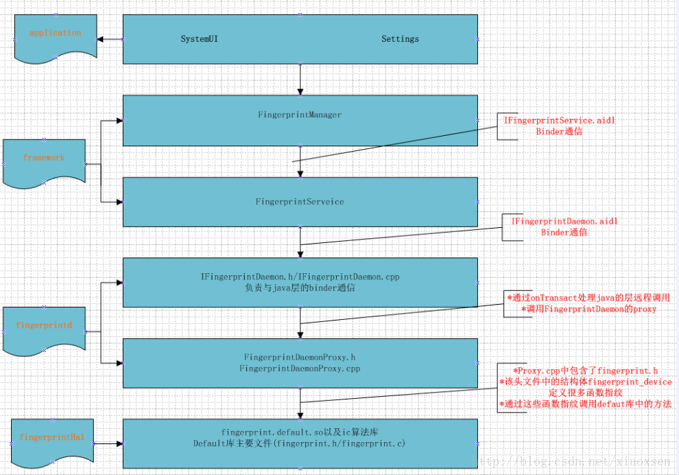
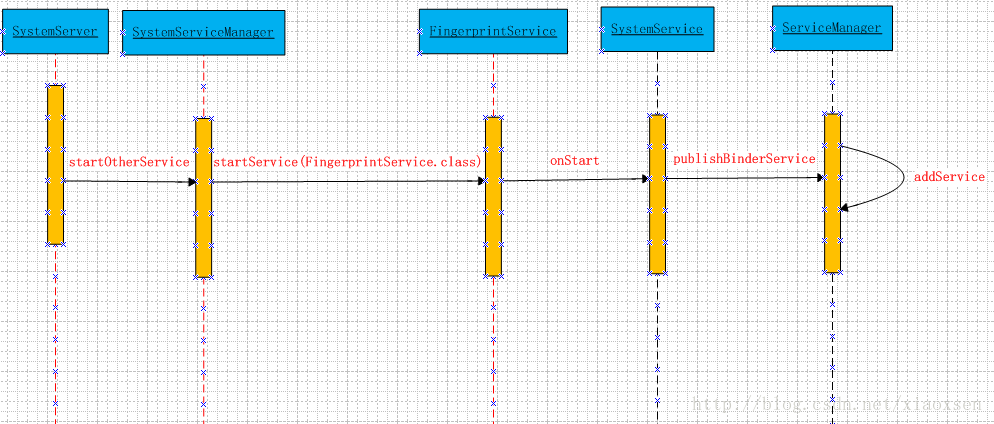
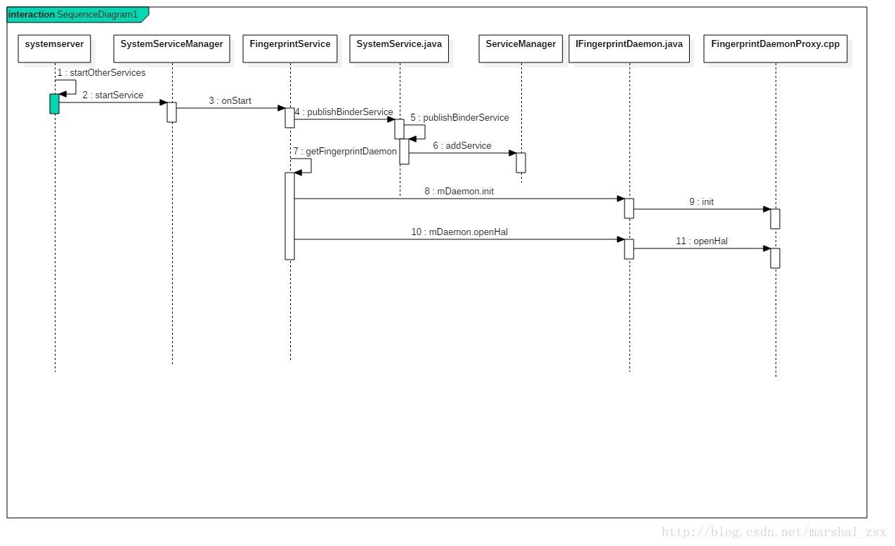

# Fingerprint
## Fingerprint上层总体架构
* Fingerprint模块架构图如下，这里分为application，framework，fingerprintd和FingerprintHal这几个部分,不涉及指纹的IC库和驱动这部分,这部分逻辑由指纹厂商来实现，目前了解的并不多。

## 指纹的服务：
### FingerprintService:
#### 1.服务启动
#
	frameworks/base/services/java/com/android/server/SystemServer.java
	startOtherServices():
		if (mPackageManager.hasSystemFeature(PackageManager.FEATURE_FINGERPRINT)) {
                    mSystemServiceManager.startService(FingerprintService.class);
        }

	#先判断是否有指纹权限:[Android7.0 N 新加的功能]
	device/mediatek/mt6580/device.mk:
	ifneq ($(strip $(BIRD_SUPPORT_FP_CHIP)),)
	PRODUCT_COPY_FILES += frameworks/native/data/etc/android.hardware.fingerprint.xml:system/etc/permissions/android.hardware.fingerprint.xml
	endif

	android.hardware.fingerprint.xml里面的内容:
	<permissions>
	    <feature name="android.hardware.fingerprint" />
	</permissions>

	这时会将FingerprintService添加到ServiceManager中去，如下图：

	frameworks/base/services/core/java/com/android/server/SystemServiceManager.java
		startService():
			...
	        // Register it.注册服务
            mServices.add(service);

            // Start it.
            try {
                service.onStart();
            } catch (RuntimeException ex) {
                throw new RuntimeException("Failed to start service " + name
                        + ": onStart threw an exception", ex);
            }
            return service;

	frameworks/base/services/core/java/com/android/server/SystemService.java
		publishBinderService():
			ServiceManager.addService(name, service, allowIsolated);
	...

	frameworks/base/core/java/android/os/ServiceManager.java
		public static void addService(String name, IBinder service) {
        	try {
            	getIServiceManager().addService(name, service, false);
        		} catch (RemoteException e) {
            	Log.e(TAG, "error in addService", e);
        		}
    		}
	
	frameworks/base/core/java/android/app/SystemServiceRegistry.java
		registerService(Context.FINGERPRINT_SERVICE, FingerprintManager.class,new CachedServiceFetcher<FingerprintManager>() {
         @Override
         public FingerprintManager createService(ContextImpl ctx) {
                IBinder binder = ServiceManager.getService(Context.FINGERPRINT_SERVICE);
				IFingerprintService service = IFingerprintService.Stub.asInterface(binder);
				return new FingerprintManager(ctx.getOuterContext(), service);
         }});

*	将FingerprintService添加到ServiceManager中后，在SystemServiceRegistry.java中静态代码块中注册服务的时候，可以从ServiceManager中获取FingerprintService的Binder对象，从而可以构造出FingerprintManager对象，这样app端就可以通过Context来获取FingerprintManager对象。 	
*	这样，app端通过Context获取FingerprintManager，通过调用FingerprintManager的接口来实现相应的功能，FingerprintManager转调FingerprintService中方法，FingerprintService负责管理整个注册，识别、删除指纹、检查权限等流程的逻辑，相当于hal层和framework层的一个媒介。FingerprintService调用fingerprintd的接口，通过fingerprintd和FingerprintHal层进行通信。

#### 2.获取fingerprintd服务
	1.获取fingerprintd
	2.向fingerprintd注册回调函数mDaemonCallback
	3.调用获取fingerprintd的openhal函数
	4.建立fingerprint文件系统节点，设置节点访问权限，调用fingerprintd的setActiveGroup，
	  将路径传下去。此路径一半用来存储指纹模板的图片等
	
	代码：mDaemonCallback
	private static final String FINGERPRINTD = "android.hardware.fingerprint.IFingerprintDaemon";

	public IFingerprintDaemon getFingerprintDaemon() {
        if (mDaemon == null) {
             //①获取fingerprintd
            mDaemon = IFingerprintDaemon.Stub.asInterface(ServiceManager.getService(FINGERPRINTD));
            if (mDaemon != null) {
                try {
                    mDaemon.asBinder().linkToDeath(this, 0);
                    //②向fingerprintd注册回调函数mDaemonCallback
                    mDaemon.init(mDaemonCallback);
                    //③调用获取fingerprintd的openhal函数
                    mHalDeviceId = mDaemon.openHal();
                    /*④建立fingerprint文件系统节点，设置节点访问权限，
                    调用fingerprintd的setActiveGroup，
                    将路径传下去。此路径一半用来存储指纹模板的图片等*/
                    if (mHalDeviceId != 0) {
                        updateActiveGroup(ActivityManager.getCurrentUser());
                    } else {
                        Slog.w(TAG, "Failed to open Fingerprint HAL!");
                        mDaemon = null;
                    }
                } catch (RemoteException e) {
                    Slog.e(TAG, "Failed to open fingeprintd HAL", e);
                    mDaemon = null; // try again later!
                }
            } else {
                Slog.w(TAG, "fingerprint service not available");
            }
        }
        return mDaemon;
    }
http://blog.csdn.net/marshal_zsx/article/details/75674947
http://blog.csdn.net/marshal_zsx/article/details/75674947
### Fingerprintd:

### 指纹守护进程
