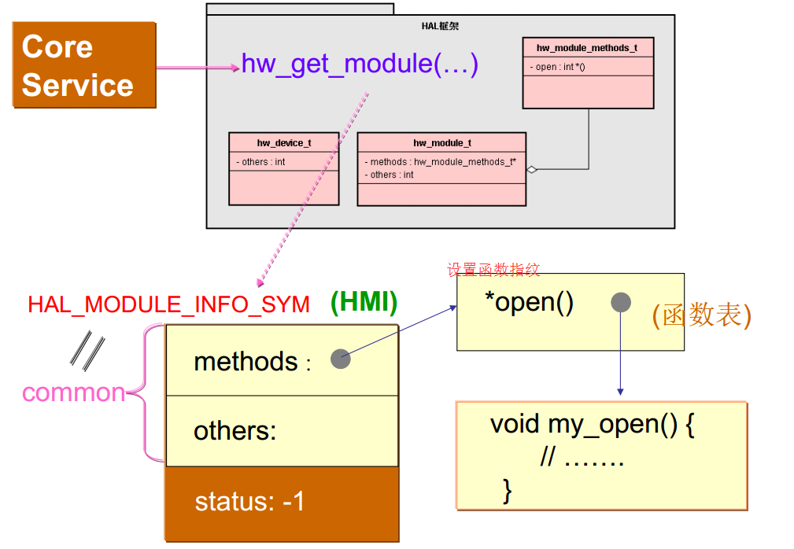
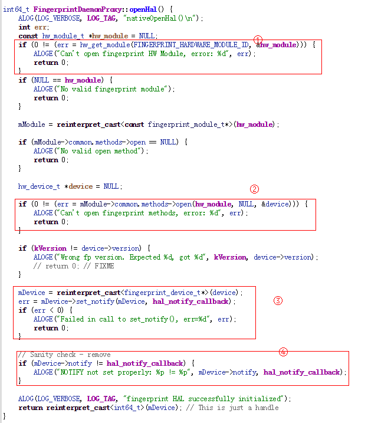

# Fingerprint
## Fingerprint上层总体架构
* Fingerprint模块架构图如下，这里分为application，framework，fingerprintd和FingerprintHal这几个部分,不涉及指纹的IC库和驱动这部分,这部分逻辑由指纹厂商来实现，目前了解的并不多。

## 指纹的服务：
### FingerprintService:
#### 1.服务启动
#
	frameworks/base/services/java/com/android/server/SystemServer.java
	startOtherServices():
		if (mPackageManager.hasSystemFeature(PackageManager.FEATURE_FINGERPRINT)) {
                    mSystemServiceManager.startService(FingerprintService.class);
        }

	#先判断是否有指纹权限:[Android7.0 N 新加的功能]
	device/mediatek/mt6580/device.mk:
	ifneq ($(strip $(BIRD_SUPPORT_FP_CHIP)),)
	PRODUCT_COPY_FILES += frameworks/native/data/etc/android.hardware.fingerprint.xml:system/etc/permissions/android.hardware.fingerprint.xml
	endif

	android.hardware.fingerprint.xml里面的内容:
	<permissions>
	    <feature name="android.hardware.fingerprint" />
	</permissions>

	这时会将FingerprintService添加到ServiceManager中去，如下图：

#
	frameworks/base/services/core/java/com/android/server/SystemServiceManager.java
		startService():
			...
	        // Register it.注册服务
            mServices.add(service);

            // Start it.
            try {
                service.onStart();
            } catch (RuntimeException ex) {
                throw new RuntimeException("Failed to start service " + name
                        + ": onStart threw an exception", ex);
            }
            return service;

	frameworks/base/services/core/java/com/android/server/SystemService.java
		publishBinderService():
			ServiceManager.addService(name, service, allowIsolated);
	...

	frameworks/base/core/java/android/os/ServiceManager.java
		public static void addService(String name, IBinder service) {
        	try {
            	getIServiceManager().addService(name, service, false);
        		} catch (RemoteException e) {
            	Log.e(TAG, "error in addService", e);
        		}
    		}
	
	frameworks/base/core/java/android/app/SystemServiceRegistry.java
		registerService(Context.FINGERPRINT_SERVICE, FingerprintManager.class,new CachedServiceFetcher<FingerprintManager>() {
         @Override
         public FingerprintManager createService(ContextImpl ctx) {
                IBinder binder = ServiceManager.getService(Context.FINGERPRINT_SERVICE);
				IFingerprintService service = IFingerprintService.Stub.asInterface(binder);
				return new FingerprintManager(ctx.getOuterContext(), service);
         }});

*	将FingerprintService添加到ServiceManager中后，在SystemServiceRegistry.java中静态代码块中注册服务的时候，可以从ServiceManager中获取FingerprintService的Binder对象，从而可以构造出FingerprintManager对象，这样app端就可以通过Context来获取FingerprintManager对象。 	
*	这样，app端通过Context获取FingerprintManager，通过调用FingerprintManager的接口来实现相应的功能，FingerprintManager转调FingerprintService中方法，FingerprintService负责管理整个注册，识别、删除指纹、检查权限等流程的逻辑，相当于hal层和framework层的一个媒介。FingerprintService调用fingerprintd的接口，通过fingerprintd和FingerprintHal层进行通信。

#### 2.获取fingerprintd服务
	1.获取fingerprintd
	2.向fingerprintd注册回调函数mDaemonCallback
	3.调用获取fingerprintd的openhal函数
	4.建立fingerprint文件系统节点，设置节点访问权限，调用fingerprintd的setActiveGroup，
	  将路径传下去。此路径一半用来存储指纹模板的图片等
	
	代码：
	frameworks/base/services/core/java/com/android/server/fingerprint/FingerprintService.java

	private static final String FINGERPRINTD = "android.hardware.fingerprint.IFingerprintDaemon";

	public IFingerprintDaemon getFingerprintDaemon() {
        if (mDaemon == null) {
             //①获取fingerprintd
            mDaemon = IFingerprintDaemon.Stub.asInterface(ServiceManager.getService(FINGERPRINTD));
            if (mDaemon != null) {
                try {
					//绑定死亡回调
                    mDaemon.asBinder().linkToDeath(this, 0);
                    //②向fingerprintd注册回调函数mDaemonCallback
                    mDaemon.init(mDaemonCallback);
                    //③调用获取fingerprintd的openhal函数
                    mHalDeviceId = mDaemon.openHal();
                    /*④建立fingerprint文件系统节点，设置节点访问权限，
                    调用fingerprintd的setActiveGroup，
                    将路径传下去。此路径一般用来存储指纹模板的图片等*/
                    if (mHalDeviceId != 0) {
                        updateActiveGroup(ActivityManager.getCurrentUser());
                    } else {
                        Slog.w(TAG, "Failed to open Fingerprint HAL!");
                        mDaemon = null;
                    }
                } catch (RemoteException e) {
                    Slog.e(TAG, "Failed to open fingeprintd HAL", e);
                    mDaemon = null; // try again later!
                }
            } else {
                Slog.w(TAG, "fingerprint service not available");
            }
        }
        return mDaemon;
    }

    @Override
    public void binderDied() {
        Slog.v(TAG, "fingerprintd died");
        mDaemon = null;
        handleError(mHalDeviceId, FingerprintManager.FINGERPRINT_ERROR_HW_UNAVAILABLE);
    }

### Fingerprintd:
#### fingerprintd如果划分的比较细的话，可以分为四个部分：
	1.fingerprintd.cpp   "负责将fingerprintd加入到ServiceManager中，以便FingerprintService能够获取"
	2.IFingerprintDaemon.h/IFingerprintDaemon.cpp  "负责java层到fingerprintd的Binder通信"
	3.FingerprintDaemonProxy.h/FingerprintDaemonProxy.cpp  "负责fingerprintd和Fignerprint hal层的通信"
	4.IFingerprintDaemonCallback.h/IFingerprintDaemonCallback.cpp "负责将指纹的回调结果传给java层"
* fingerprintd在init.rc有相应的开机启动脚本，所以一开机就会跑它的main函数。fingerprintd作为一个独立的进程运行，负责将Framework和Hal层的通信连接起来。
#
	int main() {
    ALOGI("Starting " LOG_TAG);
    android::sp<android::IServiceManager> serviceManager = android::defaultServiceManager();
    android::sp<android::FingerprintDaemonProxy> proxy =
            android::FingerprintDaemonProxy::getInstance();
    android::status_t ret = serviceManager->addService(
            android::FingerprintDaemonProxy::descriptor, proxy);
    if (ret != android::OK) {
        ALOGE("Couldn't register " LOG_TAG " binder service!");
        return -1;
    }
    /*
     * We're the only thread in existence, so we're just going to process
     * Binder transaction as a single-threaded program.
     */
    android::IPCThreadState::self()->joinThreadPool();
    ALOGI("Done");
    return 0;
	}
* fingerprintd 的main函数就是将fingerprintd添加到servicemanager中管理。然后开了一个线程，等待binder消息。
#### IFingerprintDaemon是如何跟framework通信的
* system/core/fingerprintd/IFingerprintDaemon.h
#
	#ifndef IFINGERPRINT_DAEMON_H_
	#define IFINGERPRINT_DAEMON_H_
	
	#include <binder/IInterface.h>
	#include <binder/Parcel.h>
	
	namespace android {
	
	class IFingerprintDaemonCallback;
	
	/*
	* Abstract base class for native implementation of FingerprintService.
	*
	* Note: This must be kept manually in sync with IFingerprintDaemon.aidl
	*/
	class IFingerprintDaemon : public IInterface, public IBinder::DeathRecipient {
    public:
        enum {
           AUTHENTICATE = IBinder::FIRST_CALL_TRANSACTION + 0,
           CANCEL_AUTHENTICATION = IBinder::FIRST_CALL_TRANSACTION + 1,
           ENROLL = IBinder::FIRST_CALL_TRANSACTION + 2,
           CANCEL_ENROLLMENT = IBinder::FIRST_CALL_TRANSACTION + 3,
           PRE_ENROLL = IBinder::FIRST_CALL_TRANSACTION + 4,
           REMOVE = IBinder::FIRST_CALL_TRANSACTION + 5,
           GET_AUTHENTICATOR_ID = IBinder::FIRST_CALL_TRANSACTION + 6,
           SET_ACTIVE_GROUP = IBinder::FIRST_CALL_TRANSACTION + 7,
           OPEN_HAL = IBinder::FIRST_CALL_TRANSACTION + 8,
           CLOSE_HAL = IBinder::FIRST_CALL_TRANSACTION + 9,
           INIT = IBinder::FIRST_CALL_TRANSACTION + 10,
           POST_ENROLL = IBinder::FIRST_CALL_TRANSACTION + 11,
           ENUMERATE = IBinder::FIRST_CALL_TRANSACTION + 12,
        };

        IFingerprintDaemon() { }
        virtual ~IFingerprintDaemon() { }
        virtual const android::String16& getInterfaceDescriptor() const;

        // Binder interface methods
        virtual void init(const sp<IFingerprintDaemonCallback>& callback) = 0;
        virtual int32_t enroll(const uint8_t* token, ssize_t tokenLength, int32_t groupId,
                int32_t timeout) = 0;
        virtual uint64_t preEnroll() = 0;
        virtual int32_t postEnroll() = 0;
        virtual int32_t stopEnrollment() = 0;
        virtual int32_t authenticate(uint64_t sessionId, uint32_t groupId) = 0;
        virtual int32_t stopAuthentication() = 0;
        virtual int32_t remove(int32_t fingerId, int32_t groupId) = 0;
        virtual int32_t enumerate() = 0;
        virtual uint64_t getAuthenticatorId() = 0;
        virtual int32_t setActiveGroup(int32_t groupId, const uint8_t* path, ssize_t pathLen) = 0;
        virtual int64_t openHal() = 0;
        virtual int32_t closeHal() = 0;

        // DECLARE_META_INTERFACE - C++ client interface not needed
        static const android::String16 descriptor;
        static void hal_notify_callback(const fingerprint_msg_t *msg);
	};
	
	// ----------------------------------------------------------------------------
	
	class BnFingerprintDaemon: public BnInterface<IFingerprintDaemon> {
	    public:
	       virtual status_t onTransact(uint32_t code, const Parcel& data, Parcel* reply,
	               uint32_t flags = 0);
	    private:
	       bool checkPermission(const String16& permission);
	};
	
	} // namespace android
	#endif // IFINGERPRINT_DAEMON_H_

* java层到fingerprintd的通信这里同样是采用binder方式，注意到上面IFingerprintDaemon.h第30行的NOTE，需要手动保证IFingerprintDaemon.h文件与IFingerprintDaemon.aidl文件一致，由于java层aidl文件编译时会自动编译成IFingerprintDaemon.java文件。
* frameworks/base/core/java/android/hardware/fingerprint/IFingerprintDaemon.aidl
#
	interface IFingerprintDaemon {
    int authenticate(long sessionId, int groupId);
    int cancelAuthentication();
    int enroll(in byte [] token, int groupId, int timeout);
    int cancelEnrollment();
    long preEnroll();
    int remove(int fingerId, int groupId);
    long getAuthenticatorId();
    int setActiveGroup(int groupId, in byte[] path);
    long openHal();
    int closeHal();
    void init(IFingerprintDaemonCallback callback);
    int postEnroll();
    int enumerate();
    int cancelEnumeration();
	}
#
	当添加接口来调用指纹底层暴露的接口，在IFingerprintDaemon.h文件中添加类似上面35行到68行的枚举，
	枚举的值需要与java层aidl自动生成的java文件中的枚举保持一致。另外还需要在上面68行处加上描述这些接口的纯虚函数
	（c++中的纯虚函数类似java的抽象方法，用于定义接口的规范，在C++中，一个具有纯虚函数的基类被称为抽象类）。
* 如下面截图对比，我们发现IFingerprintDaemon.cpp和java层aidl生成的IFingerprintDaemon.java在onTransact是基本一致的。这样我们也就明白了为什么上面说需要手动和IFingerprintDaemon.aidl保持同步了，这样方式类似我们平时在三方应用使用aidl文件，需要保持client端和server端aidl文件一致。
#
	可以看到onTransact有四个参数
	code ， data ，replay ， flags
	code 是一个整形的唯一标识，用于区分执行哪个方法，客户端会传递此参数，告诉服务端执行哪个方法
	data客户端传递过来的参数
	replay服务器返回回去的值
	flags标明是否有返回值，0为有（双向），1为没有（单向）

	status_t BnFingerprintDaemon::onTransact(uint32_t code, const Parcel& data, Parcel* reply,
        uint32_t flags) {
    switch(code) {
        case AUTHENTICATE: {
            CHECK_INTERFACE(IFingerprintDaemon, data, reply);
            if (!checkPermission(HAL_FINGERPRINT_PERMISSION)) {
                return PERMISSION_DENIED;
            }
            const uint64_t sessionId = data.readInt64();
            const uint32_t groupId = data.readInt32();
            const int32_t ret = authenticate(sessionId, groupId);
            reply->writeNoException();
            reply->writeInt32(ret);
            return NO_ERROR;
        };
		...
		}

#### openhal():
	frameworks/base/services/core/java/com/android/server/fingerprint/FingerprintService.java
	getFingerprintDaemon():
		mHalDeviceId = mDaemon.openHal();

	system/core/fingerprintd/FingerprintDaemonProxy.cpp
* TEE:
#
	#define GOODIX_FINGERPRINT_HARDWARE_MODULE_ID "gf_fingerprint"
	#define FPSENSOR_FINGERPRINT_HARDWARE_MODULE_ID  "fpsensor_fingerprint"
	#define CDFINGER_FINGERPRINT_HARDWARE_MODULE_ID  "cdfinger.fingerprint"
	static const char *variant_keys[] = {
		FPSENSOR_FINGERPRINT_HARDWARE_MODULE_ID,   
		GOODIX_FINGERPRINT_HARDWARE_MODULE_ID,
		CDFINGER_FINGERPRINT_HARDWARE_MODULE_ID,
		FINGERPRINT_HARDWARE_MODULE_ID,
	};
	
	#define FPTAG "fpCorefpd"
	#define ANDROID_FPTAG "fpCorefpd"
	
	static const int FP_VARIANT_KEYS_COUNT =
	    (sizeof(variant_keys)/sizeof(variant_keys[0]));

		for(int i = 0; i < FP_VARIANT_KEYS_COUNT; i++) {
        const hw_module_t *hw_module = NULL;
        ALOGD(FPTAG"fpCore open hal the varient_key is: %s", variant_keys[i]);
        if (0 != (err = hw_get_module(variant_keys[i], &hw_module))) {
            ALOGE(FPTAG"Can't open fingerprint HW Module, error: %d", err);
            continue;
        }
		...
		}
* REE:
#
	#pragma message("BIRD_FINGERPRINT_USE_REE_MODE is defined!!!\n") 
    typedef struct fingerprint_dev {
			const char *dev_name;      
			const char *dev_id;   
			const char *chip_name;  
			} fingerprint_dev_t;

		fingerprint_dev_t fingerprint_list[] = {
			{
				.dev_name = "/dev/bl229x",
				.dev_id = "blestech.fingerprint",    
				.chip_name = "blestech",
			},
			{
				.dev_name = "/dev/cs_spi",
				.dev_id = "chipsailing.fingerprint",    
				.chip_name = "chipsailing",
			},
		};
	#endif 

	int64_t FingerprintDaemonProxy::openHal() {
    ALOG(LOG_VERBOSE, LOG_TAG, "nativeOpenHal()\n");
    int err;
    const hw_module_t *hw_module = NULL;
    
    int i;
	const char *fingerprint_id = "fingerprint";
	int len = sizeof(fingerprint_list) / sizeof(fingerprint_dev_t);

	for (i = 0;i < len; i++) {
		if (!access(fingerprint_list[i].dev_name, F_OK)) {
			fingerprint_id = fingerprint_list[i].dev_id;
			property_set("sys.fingerprint.chip", fingerprint_list[i].chip_name);
			ALOG(LOG_VERBOSE, LOG_TAG, "Detect fingerprint id: %s ,chip_name:%s\n", fingerprint_id,fingerprint_list[i].chip_name);
		}
	}
	...
	}
#### fingerprintd进程是如何和Fingerprint Hal层是如何传递数据
* 说到Hal层，即硬件抽象层，Android系统为HAL层中的模块接口定义了规范，所有工作于HAL的模块必须按照这个规范来编写模块接口，否则将无法正常访问硬件。 

* 指纹的HAL层规范fingerprint.h在/hardware/libhardware/include/hardware/下可以看到。
* 我们注意到在fingerprint.h中定义了两个结构体，分别是fingerprint_device_t和fingerprint_module_t,如下所示：
#
	typedef struct fingerprint_device {
    /**
     * Common methods of the fingerprint device. This *must* be the first member
     * of fingerprint_device as users of this structure will cast a hw_device_t
     * to fingerprint_device pointer in contexts where it's known
     * the hw_device_t references a fingerprint_device.
     */
    struct hw_device_t common;
	...
	}fingerprint_device_t;

	typedef struct fingerprint_module {
    /**
     * Common methods of the fingerprint module. This *must* be the first member
     * of fingerprint_module as users of this structure will cast a hw_module_t
     * to fingerprint_module pointer in contexts where it's known
     * the hw_module_t references a fingerprint_module.
     */
    struct hw_module_t common;
	} fingerprint_module_t;	

* fingerprint\_device\_t结构体，用于描述指纹硬件设备；fingerprint\_module\_t结构体，用于描述指纹硬件模块。在FingerprintDaemonProxy.cpp就是通过拿到fingerprint\_device\_t这个结构体来和Fingerprint HAL层通信的。
* 当需要添加接口调用指纹底层时，在这个fingerprint.h中同样需要添加函数指针，然后通过FingerprintDaemonProxy.cpp中拿到这个fingerprint\_device\_t来调用fingerprint.h中定义的函数指针，也就相当于调用指纹HAL层。
* 我们重点看一下它的openHal（）函数。

#### openHal的方法这里主要看上面三个部分： 
* 1.根据名称获取指纹hal层模块。hw_module这个一般由指纹芯片厂商根据 fingerprint.h实现，hw\_get\_module是由HAL框架提供的一个公用的函数，这个函数的主要功能是根据模块ID(module_id)去查找注册在当前系统中与id对应的硬件对象，然后载入(load)其相应的HAL层驱动模块的*so文件。 
* 2.调用fingerprint\_module\_t的open函数 
* 3.向hal层注册消息回调函数，主要回调 注册指纹进度，识别结果，错误信息等等 
* 4.判断向hal层注册消息回调是否注册成功

## 判断指纹是否存在
	packages/apps/Settings/src/com/android/settings/SecuritySettings.java
	onCreate():
		...
		createPreferenceHierarchy():
		...
			maybeAddFingerprintPreference(root, mProfileChallengeUserId);

		maybeAddFingerprintPreference():
			Preference fingerprintPreference =
			FingerprintSettings.getFingerprintPreferenceForUser(securityCategory.getContext(), userId);
			if (fingerprintPreference != null) {
				securityCategory.addPreference(fingerprintPreference);
			}

	packages/apps/Settings/src/com/android/settings/fingerprint/FingerprintSettings.java
	getFingerprintPreferenceForUser():
		FingerprintManager fpm = (FingerprintManager) context.getSystemService(Context.FINGERPRINT_SERVICE);
		if (fpm == null || !fpm.isHardwareDetected()) {
            Log.v(TAG, "No fingerprint hardware detected!!");
            return null;
        }

	frameworks/base/core/java/android/hardware/fingerprint/FingerprintManager.java
	public boolean isHardwareDetected() {
        if (mService != null) {
            try {
                long deviceId = 0; /* TODO: plumb hardware id to FPMS */
                return mService.isHardwareDetected(deviceId, mContext.getOpPackageName());
            } catch (RemoteException e) {
                throw e.rethrowFromSystemServer();
            }
        } else {
            Log.w(TAG, "isFingerprintHardwareDetected(): Service not connected!");
        }
        return false;
    }

	frameworks/base/services/core/java/com/android/server/fingerprint/FingerprintService.java
	@Override // Binder call
    public boolean isHardwareDetected(long deviceId, String opPackageName) {
        if (!canUseFingerprint(opPackageName, false /* foregroundOnly */,
            Binder.getCallingUid(), Binder.getCallingPid())) {
            return false;
         }
         return mHalDeviceId != 0;//此处mDaemon.openHal()要成功
    }

	canUseFingerprint():
	private boolean canUseFingerprint(String opPackageName, boolean foregroundOnly, int uid,int pid) {
        checkPermission(USE_FINGERPRINT);
        if (isKeyguard(opPackageName)) {
            return true; // Keyguard is always allowed
        }
        if (!isCurrentUserOrProfile(UserHandle.getCallingUserId())) {
            Slog.w(TAG,"Rejecting " + opPackageName + " ; not a current user or profile");
            return false;
        }
        if (mAppOps.noteOp(AppOpsManager.OP_USE_FINGERPRINT, uid, opPackageName)
                != AppOpsManager.MODE_ALLOWED) {
            Slog.w(TAG, "Rejecting " + opPackageName + " ; permission denied");
            return false;
        }
        if (foregroundOnly && !isForegroundActivity(uid, pid)) {
            Slog.w(TAG, "Rejecting " + opPackageName + " ; not in foreground");
            return false;
        }
        return true;
    }
		

	
