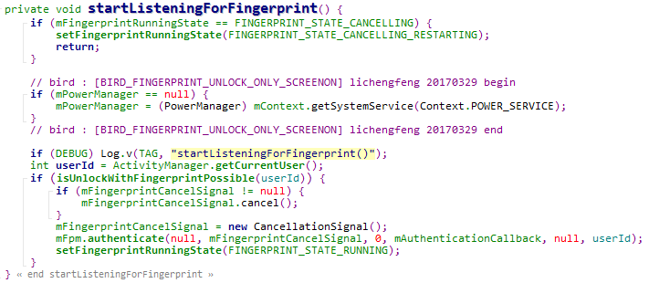

## 解锁：
	updateFingerprintListeningState:更新指纹监听

	shouldListenForFingerprint:是否需要监听

	stopListeningForFingerprint:停止监听指纹

	startListeningFingerprint:开始指纹的监听

	isUnlockWithFingerprintPossible:是否可以解锁

	